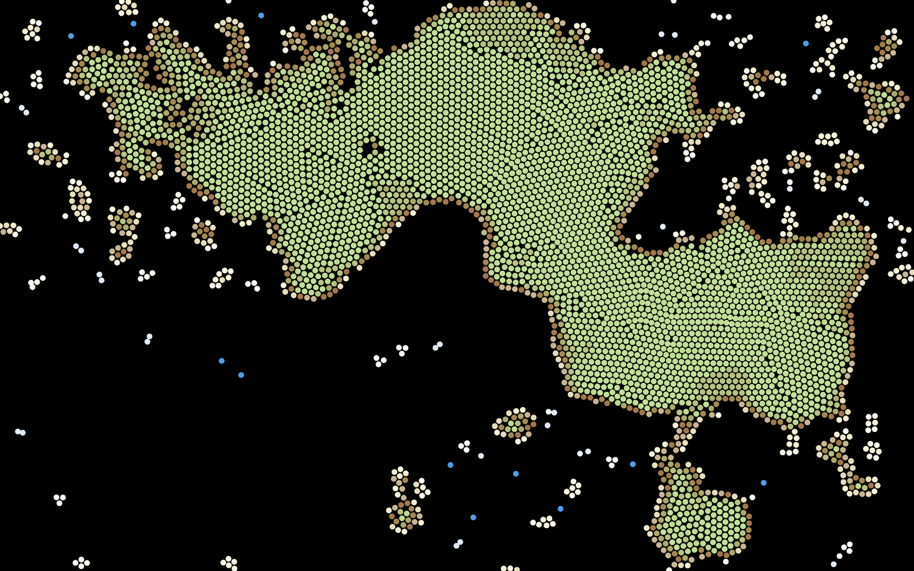
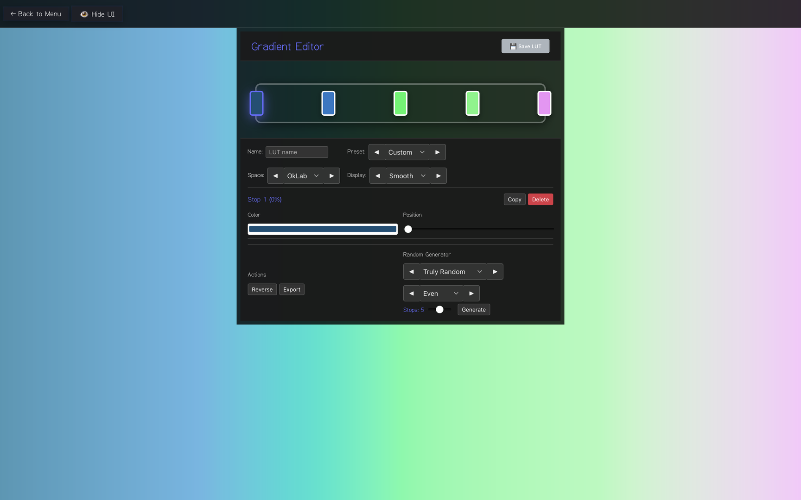

# Vizza

A collection of interactive GPU-accelerated simulations for fun and beauty. Features a friendly UI that puts you in control.

## Simulations

### Slime Mold

Agent-based simulation where creatures follow trails to create emergent networks.


### Gray-Scott

Reaction-diffusion simulation modeling chemical reactions that create organic patterns.


### Particle Life

Multi-species particle simulation with attraction/repulsion interactions.


### Flow

Flow field simulation with particle movement patterns.


### Pellets

Particle simulation with gravity and density-based interactions.



### Gradient Editor

Create custom color schemes for the other simulations.



## Getting Started

### Prerequisites

- Node.js 18+
- Rust toolchain
- Tauri CLI

### Development

```bash
cargo tauri dev
```

### Build

```bash
cargo tauri build
```

## Tech Stack

- Frontend: Svelte 5 + TypeScript
- Backend: Rust with Tauri
- Graphics: WebGPU
- Build: Vite
