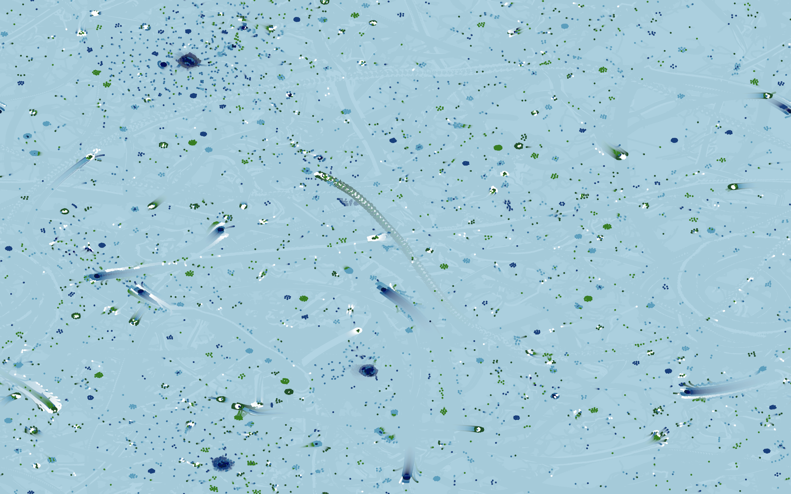

# Vizza

A collection of interactive GPU-accelerated simulations for fun and beauty. Features a friendly UI that puts you in control.

## How to play

Windows, MacOS, and Linux are supported.

Download the latest version for your platform from the [releases page](https://github.com/Velfi/Vizza/releases).

- For Windows: `Vizza_<version>_x64-setup.exe` OR `Vizza_<version>_x64_en-US.msi`, both are equivalent.
- For MacOS: `Vizza_<version>_aarch64.dmg` for Apple Silicon, `Vizza_<version>_x64.dmg` for Intel.
- For Linux: `Vizza-<version>-1.x86_64.rpm` or `Vizza_<version>_amd64.AppImage` or `Vizza_<version>_amd64.deb`

Then, open the downloaded file and install the app, usually by double-clicking on it. You'll have to click past security warnings because I haven't paid for a developer certificate yet.

Once the app is installed, you can run it like any other app. Presets and color schemes you create will be saved to your Documents folder.

## Simulations

### Slime Mold

Agent-based simulation where creatures follow trails to create emergent networks.


### Gray-Scott

Reaction-diffusion simulation modeling chemical reactions that create organic patterns.


### Particle Life

Multi-species particle simulation with attraction/repulsion interactions.



### Flow

Flow field simulation with particle movement patterns.


### Pellets

Particle simulation with gravity and density-based interactions.


### Gradient Editor

Create custom color schemes for the other simulations.


### Voronoi Cellular Automata

Cellular automata with Voronoi cells that move and shift.


### Moiré

Moiré patterns with distortion effects.


## For Developers

### Prerequisites

- [Node.js 18+](https://nodejs.org/en/download/)
- [Rust toolchain](https://www.rust-lang.org/tools/install)
- [Tauri CLI](https://v2.tauri.app/reference/cli/)

### Development

```bash
cargo tauri dev
```

### Build

```bash
cargo tauri build
```

## Tech Stack

- Frontend: Svelte 5 + TypeScript
- Backend: Rust with Tauri
- Graphics: WebGPU
- Build: Vite
